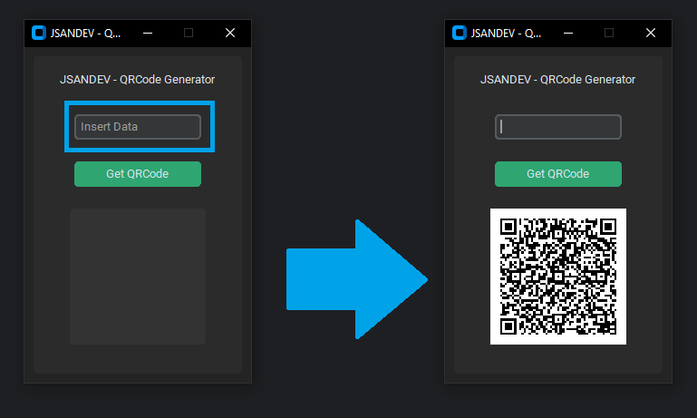

# QRCode Generator

Uma aplicação em Python para geração de QR Codes com interface gráfica moderna, utilizando a biblioteca `customtkinter`. Este programa permite que o usuário insira dados, gere QR Codes e os visualize diretamente na interface. Os QR Codes são salvos automaticamente em um diretório chamado `qrcodes`.

---

## 📋 Funcionalidades

- Interface gráfica moderna e intuitiva.
- Geração de QR Codes a partir de qualquer texto inserido.
- Exibição do QR Code gerado diretamente na aplicação.
- Armazenamento automático dos QR Codes gerados no diretório `qrcodes`.
- Suporte à formatação de data e hora com fuso horário de Lisboa.

---

## 🛠️ Tecnologias Utilizadas

- **Python**: Linguagem de programação principal.
- **customtkinter**: Para criação da interface gráfica moderna.
- **pyqrcode**: Para geração de QR Codes.
- **Pillow (PIL)**: Para manipulação de imagens.
- **pytz**: Para gerenciamento de fusos horários.

---

## 📂 Estrutura do Projeto

- **`app.py`**: Arquivo principal contendo o código da aplicação.
- **`qrcodes/`**: Diretório criado para que os QR Codes sejam salvos.

---

## 🚀 Como Executar o Projeto

### Pré-requisitos

- Python 3.8 ou superior.
- Instale as dependências com o comando:
  ```bash
  pip install customtkinter pyqrcode pillow pytz
  ```

## Passo a Passo
1. Baixe ou clone este repositório:
    ```bash
    git clone https://github.com/seu_usuario/QrcodeGenerator.git
    ```

2. Navegue até o diretório do projeto:
    ```bash
      cd QrcodeGenerator
    ```
3. Execute o script:
    ```bash
      python app.py
    ```
4. Insira os dados no campo de texto e clique em "Get QRCode" para gerar e visualizar o QR Code.



## 🖥️ Interface Gráfica
### Componentes
- **Campo de entrada**: Área para inserir os dados que serão transformados em QR Code.
- **Botão "Get QRCode"**: Gera o QR Code com base nos dados inseridos.
- **Exibição do QR Code**: Mostra o QR Code gerado no centro da interface.

## 📝 Notas Importantes
- Os QR Codes gerados são salvos no formato PNG no diretório qrcodes, com o nome no padrão qrcode_YYYYMMDD_HHMMSS.png.
- Certifique-se de que o diretório atual possui permissões de escrita para salvar os QR Codes.


## 📖 Personalização
- Você pode personalizar o projeto ajustando os seguintes parâmetros no código:

  - **Cor tema da interface**: (Mude "green" para "blue", "dark-blue", etc.)
    ```bash
      customtkinter.set_default_color_theme("green")
    ```    

  - **Fuso horário**: (Substitua "Europe/Lisbon" pelo fuso horário desejado.)
    ```bash
      FUSO_HORARIO_LISBOA = timezone("Europe/Lisbon")
    ```

  - **Dimensões do QR Code gerado**: (Altere o valor de scale para ajustar o tamanho do QR Code.)
    ```bash
      criar_qrcode(dados, caminho_arquivo, scale=6)
    ```


## Licença
Este projeto está licenciado sob a [MIT License](https://opensource.org/license/mit).

## 📷 Exemplo de Uso
1. Insira "Hello, World!" no campo de texto.
2. Clique no botão "Get QRCode".
3. O QR Code será gerado e exibido na interface.
4. O arquivo será salvo automaticamente no diretório qrcodes.


## Autor
Este projeto foi desenvolvido por [Jonathan Alves](https://www.linkedin.com/in/jonathan-s-alves/). 